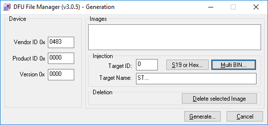
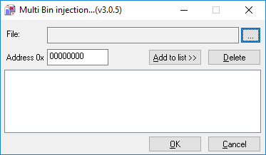
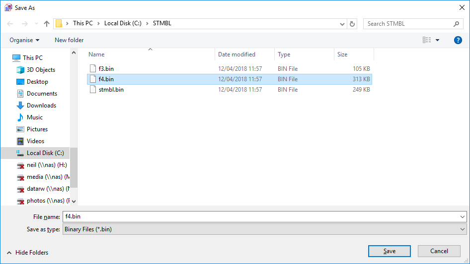
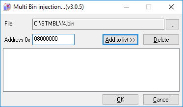
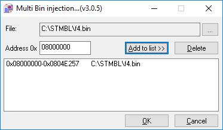
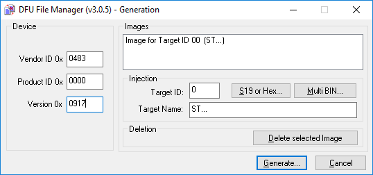
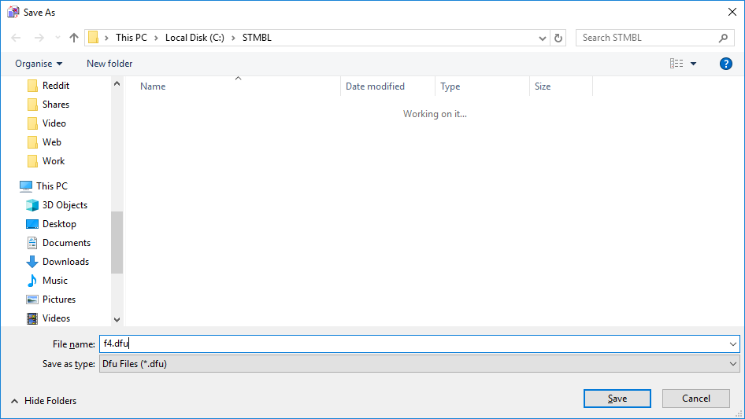
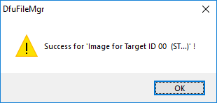

# STMBL firmware flashing under Windows via USB DFU using ST DfuSe
INCOMPLETE DO NOT USE - DRAFT - MAY BE INCORRECT
This documents the initial flashing of an "empty" board.
## Download
- Download `f4.bin` (for the LV board) and `f3.bin` (for the HV board) from https://github.com/rene-dev/stmbl/releases
- Download `DfuSe Utility` from http://www.st.com/en/development-tools/stsw-stm32080.html 
Note that ST refer to the utility by several different names, and that the use of English in the package is not perfect. This package contains:
- GUI utility flashing (`DfuSeDemo`)
- Utility to create DFU files (`Dfu file manager`)
- STM32 DFU device driver.
## Create DFU File from BIN file
The downloaded file needs to be converted from BIN to DFU. For each BIN file you must:

- Run `Dfu file manager` from the Windows Start Menu

- Click `OK` to choose `GENERATE`

- Choose `Multi Bin...`

- Click `...` to open the file

- Select the BIN file

- Enter the correct address `0x08000000`

- Click `Add to list`
- Click `OK`

- Enter the version of the firmware as a 4 digit hex number
- Click `Generate...`

- Type the name of the DFU file to be created (you can optionally add the version number as part of the name)

- Click `Save`

## Put the Board into DFU Mode
- Short the programming jumper on the board you wish to program (as pictured below)
- Apply power to that board.
- Once powered up the jumper can be removed. Windows Device Manager should show `STM Device in DFU Mode` (0483:DF11)

Shorting the programming jumper on the back of the low voltage board 
	

Shorting the programming jumper on the top of the high voltage board 
	

Device manager showing board in DFU mode

# Flashing

- Start `DfuSeDemo`
- Under `Upgrade or Verify Action` click `Choose..`  

Select `f4.dfu` for the LV board or `f3.dfu` for the HV board

- Note the version displayed is what was entered earlier in `Dfu file manager`
- Note `File correctly loaded.` message
- Tick `Verify after download`
- Click `Upgrade` to flash the firmware to the board

- Accept the warning

- Observe the `Erase Phase`, followed by the `Download Phase`

- Observe successful completion

## Servoterm
Servoterm is a specialised terminal emulator that can be used to control the STMBL. It's a Chrome Extension.
The board must be in serial mode, the power must be cycled if it was previously in DFU mode for flashing.

Start servoterm from the Chrome Apps menu, found on the bookmarks bar of a new tab, the URL is chrome://apps/
The command to check the firmware version is `about`
